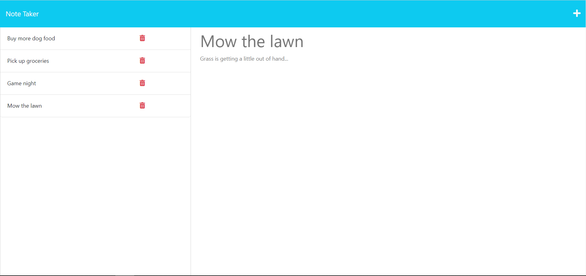

# <Your-Project-Title>

## Description

I wanted to build an app that would assist with day-to-day planning, and I needed a way to store notes to myself that I could access from multiple devices. In order to solve the problem of being able to access my notes on multiple machines, I set up this note taking app with a backend server, so that my notes are saved and I can retrieve, add and delete them easily. 

This was my first time setting up a backend server, as well as using the web service Heroku to host my app. 

## Installation

N/A

## Usage

Once on the landing page, click "Get Started" to be taken to the notes page. On the notes page, you can click the "+" button in the top right margin to create a new note. Once you've entered a title and body message, you can save with the save icon which will appear once both fields are complete. 

In order to view notes, click on the title in the left margin. Once a note is no longer needed, you can delete with the trash can icon in the left column next to each note. 

## Features

-Add new notes
-View notes
-Delete unnecessary notes

